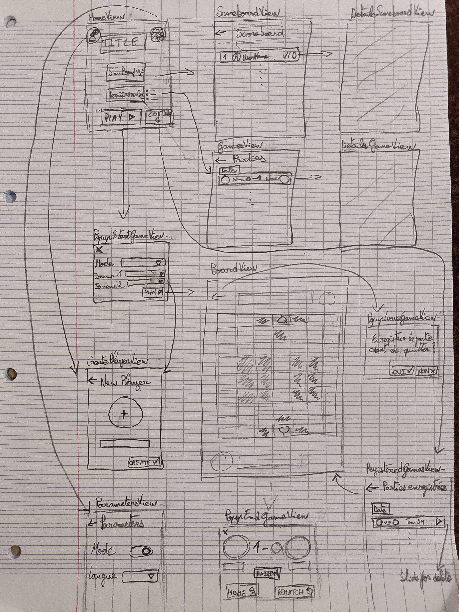

# FoodChainChess
FoodChainChess is a project to create a graphical interface for the game DouShouQi using Swift and ARKit. This project is carried out as part of the SwiftUI_ARKit_2024 course.

## 🎯 Objectives

- Create a user interface in SwiftUI for the game DouShouQi.
- Integrate ARKit to enable playing in augmented reality.
- Manage basic features such as the menu, scores, saved games, and theme management.
- Implement a functional game with the possibility of playing on the same device or potentially on two devices.

## 📋 CheckList

- ✅ Create player  
- ✅ Display all players  
- ✅ Take a picture  
- ❌ Crop a picture on the head  
- ✅ Play a game on smartphone  
    - ✅ Play again an other player  
    - ✅ Play again a bot  
    - ✅ Play with Simple Rules & Classic Rules  
- ✅ Play a game in AR  
- ✅ Dark Mode  
- ⏳ Multi languages  
- ✅ Animal sound in game  
- ❌ Persistence  
  

## 📖 Sketches




## ✨ Features

### User Interface

- **📋 Main Menu**: Access various sections of the application.
- **🏆 Best Scores**: Display statistics (#wins, #losses).
- **💾 Saved Games**: Ability to save and load games.
- **🎮 Play a Game**: 1 vs 1 mode on the same device.
- **🎨 Theme Management**: Support for light and dark themes.
- **🌐 Multilingual App** (bonus): Support for multiple languages.

### Model Integration

- **🕹️ Functional Game**: Implementation of the DouShouQi game rules.
- **🔗 Stubbed Data or API**: Use of stubbed data or API integration if available.

### Augmented Reality

- **📱 Play in AR**: 1 vs 1 mode using augmented reality via ARKit.
- **📸 Player Selection**: Taking a photo cropped around the head for player avatars.
- **🤖 AI Selection**: Ability to play against AI.

### Bonus

- **📲 Game on Two Devices**: Play a game using two different devices.

## 📚 Resources Used

- **🖥️ SwiftUI**: For creating the user interface on iOS.
- **🕶️ ARKit**: For augmented reality features.

## 📅 Evaluations

- **👥 Group Project**: The project is carried out in groups of 2 or 3 students.
- **🗣️ Individual Oral Evaluations**: Oral evaluations will take place in the last week.

## 💡 Development Advice

- **✏️ Sketches**: Some quick sketches realized before starting development to validate design concepts

## 📦 Provided Library

- A library for the game model will be provided to facilitate development.

## ⏳ Project Duration

- **👀 Views**: 1.5 weeks
- **🔗 Model Integration**: 2.5 weeks
- **🕶️ Augmented Reality**: 2 weeks

## ⚙️ Installation

1. Clone the repository:
    ```
    git clone https://codefirst.iut.uca.fr/git/SwiftUI-Arkit/FoodChainChess/
    ```
2. Open the project in Xcode.
3. Build and run the application on a simulator or a physical device.

## 📖 Usage

- Navigate the main menu to access different sections.
- Start a new game to play DouShouQi in traditional mode or augmented reality.
- Check the best scores and saved games from the main menu.

## 🤝 Contributing

Project realized by 3 students in BUT Informatique Clermont : BRODA Lou, DA COSTA CUNHA Bruno & FRANCO Nicolas.