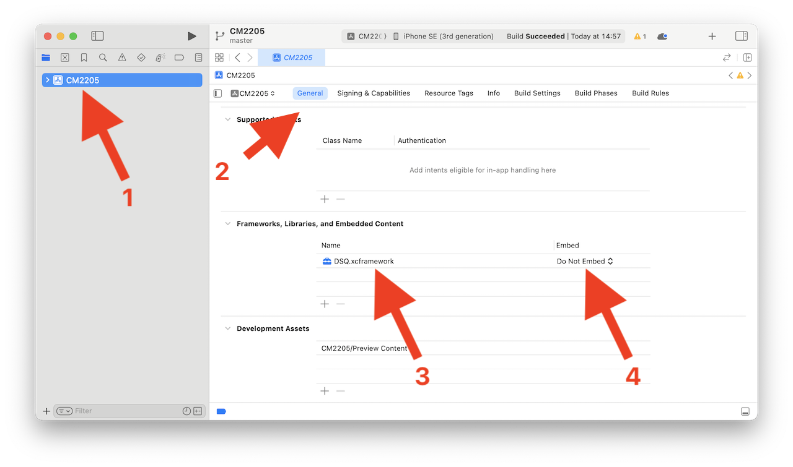

# How to use the framework?

Drag and drop the **_DSQ.xcframework_** folder in the *Frameworks, Libraries, and Embedded Content* of your XCode app settings. Change the **Embed** property to **Do Not Embed*.  

Do not forget to use the certificates provided in the [following repository](https://codefirst.iut.uca.fr/git/mchSamples_Apple/appleCertificates).  

This library has not been fully tested and may change over time. Do not hesitate to contact me if you find any bug.  

> Note:  
> A sample Command Line Tool App is provided for you to see how you can use this framework.